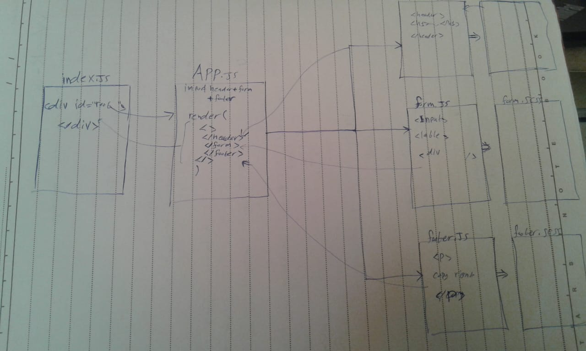

# LAB: RESTy

A browser based API testing tool
Our application will be an API testing tool that can be run in any browser, allowing a user to easily interact with APIs in a familiar interface.

### Author: Osama Mousa

### Links and Resources

- [submission PR class-16](https://github.com/401-advanced-javascript-osama/resty/pull/2)

### deployment links
(https://resty-app-27.netlify.app/)[netifly]
(https://401-advanced-javascript-osama.github.io/resty/)[github-pages]

#### How to initialize/run your application

- `npm start`

#### Tests
- Unit Tests : `npm test`

#### UML

