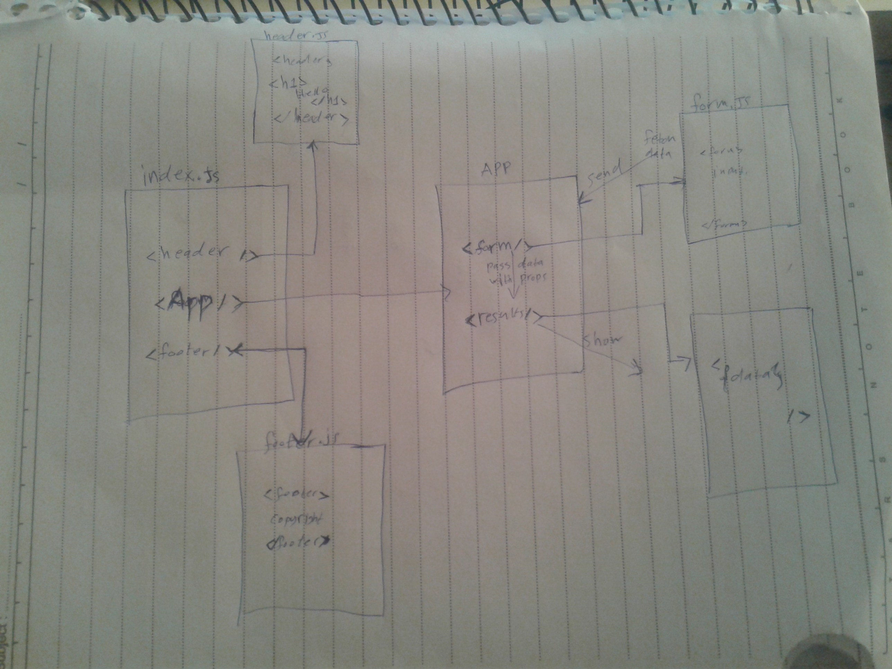

# LAB: RESTy

we will be connecting RESTy to live APIs, fetching and displaying remote data. Our primary focus will be to service GET requests

### Author: Osama Mousa

### Links and Resources

- [submission PR class-16](https://github.com/401-advanced-javascript-osama/resty/pull/3)

### deployment links

[Netlify](https://compositoin.netlify.app/)

[Netlify](https://props-and-state.netlify.app/)

#### How to initialize/run your application

- `npm start`

#### UML

